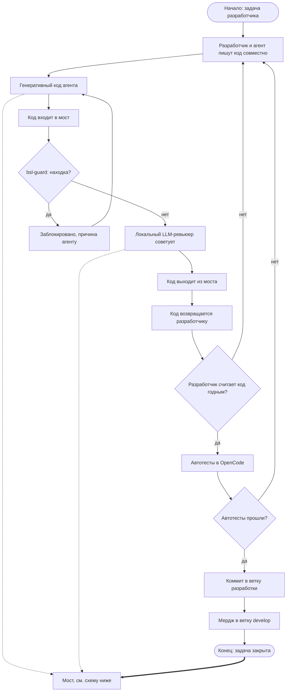
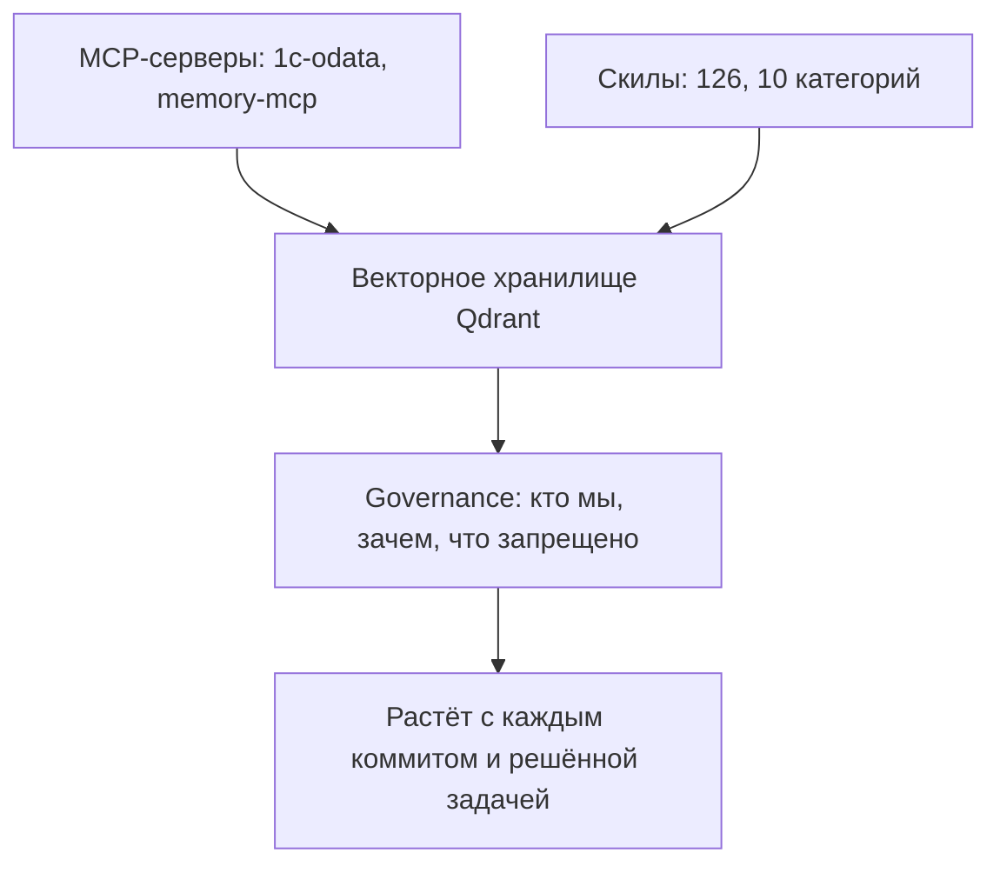
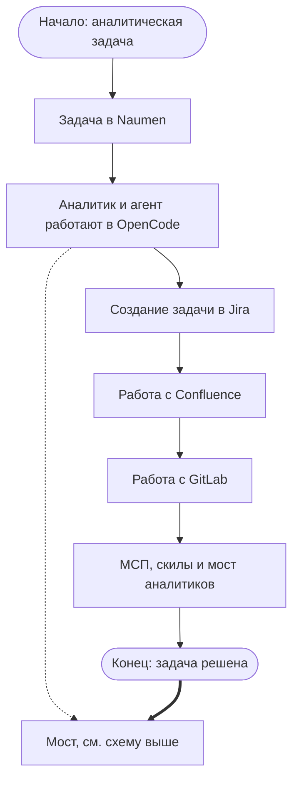

# Архитектура моста Tuning 1C

Интерактивная версия (zoom/pan/fullscreen, поиск по скилам) — [`master-shema-h-svg.html`](master-shema-h-svg.html)
в этой же папке. GitHub не выполняет HTML внутри репозитория — файл откроется как сырой текст, а не как
страница, поэтому для просмотра его нужно скачать и открыть в браузере локально. Ниже — тот же состав
и та же логика, но в виде, который GitHub рендерит прямо здесь: три mermaid-схемы плюс полный
инвентарь в виде обычных markdown-таблиц.

## Что такое мост

Мост — не сервис, а обязательная точка проверки: любой код, сгенерированный AI-агентом, проходит через
неё прежде чем его принимает человек. Задача — снижать долю ошибок, которые агент вносит в BSL-кодовую
базу ЗУП3, не запретом генеративного кода, а дисциплиной проверки и общей памятью команды. Разработчик
и аналитик — два независимых процесса, каждый со своим Linux-сервером МСП/скилов, но оба читают из
общего моста и пишут в него после завершения задачи.

## Схема — цепочка разработчика

1. Разработчик и агент пишут код совместно, 50/50 участие, в OpenCode.
2. Сгенерированный код входит в мост через МСП и скилы сервера разработчиков.
3. `bsl-guard` проверяет код детерминированными правилами. Находка → блокировка, причина уходит
   агенту, цикл возвращается на шаг 2. Без находки → дальше.
4. Локальный LLM-ревьюер даёт рекомендацию — это совет, не гейт; решение остаётся за человеком.
5. Код возвращается разработчику. Не годен → возврат на шаг 1; годен → дальше.
6. Автотесты в OpenCode через другие скилы. Не прошли → возврат на шаг 1.
7. Коммит в ветку разработки, мердж в develop — задача закрыта.

## Схема — мост (общая память)

МСП-серверы (2): `1c-odata` — OData-доступ к 1С; `memory-mcp` — память/контекст-сервер, вероятный
кандидат на retrieval-слой. Векторное хранилище — Qdrant: embedding episodic- и semantic-памяти
проекта. Governance-слой — кто мы, зачем, куда идём, что запрещено; это командная дисциплина, а не
решение конкретной задачи. Каждый коммит и каждая решённая задача пополняют память.

## Схема — цепочка аналитика

1. Задача поступает в Naumen.
2. Аналитик и агент работают в OpenCode.
3. Задача заводится в Jira, документация — в Confluence, код — в GitLab.
4. Мост аналитиков (МСП + скилы, отдельный сервер) обслуживает обращения к общей памяти.
5. Задача решена — feedback уходит в мост.

*Примечание: на интерактивной HTML-версии все три схемы стоят в один ряд в виде буквы «H»
(разработчик слева, мост посередине, аналитик справа). Markdown этого не умеет — три схемы идут
одна под другой, логика и состав узлов те же.*

## Инвентарь: что внутри моста

Источник: `список-MCP-и-скилов.md` (TooLi@opencode, 2026-09-18). Реальный состав окружения —
не предположение, не план, а то, что фактически развёрнуто.

| | |
|---|---|
| MCP-сервера | 2 |
| Скилов | 126 |
| Категорий | 10 |

| MCP-сервер | Назначение |
|---|---|
| `1c-odata` | OData-доступ к 1С — по названию |
| `memory-mcp` | Память/контекст-сервер — вероятный кандидат на retrieval-слой |

### 1C метаданные / объекты (28)

`1c-metadata-manage`, `cf-edit`, `cf-info`, `cf-init`, `cf-validate`, `cfe-borrow`, `cfe-diff`,
`cfe-init`, `cfe-patch-method`, `cfe-validate`, `meta-compile`, `meta-decompile`, `meta-edit`,
`meta-info`, `meta-remove`, `meta-validate`, `subsystem-compile`, `subsystem-edit`, `subsystem-info`,
`subsystem-validate`, `interface-edit`, `interface-validate`, `role-compile`, `role-info`,
`role-validate`, `support-edit`, `template-add`, `template-remove`

### Формы (8)

`form-add`, `form-compile`, `form-decompile`, `form-edit`, `form-info`, `form-remove`,
`form-validate`, `form-patterns`

### Макеты / СКД / XDTO (18)

`mxl-compile`, `mxl-decompile`, `mxl-info`, `mxl-validate`, `skd-compile`, `skd-decompile`,
`skd-edit`, `skd-info`, `skd-validate`, `xdto-compile`, `xdto-decompile`, `xdto-edit`, `xdto-graph`,
`xdto-info`, `xdto-validate`, `XdtoReference`, `img-grid`, `img-grid-analysis`

### Внешние обработки / отчёты (10)

`epf-init`, `epf-build`, `epf-dump`, `epf-validate`, `epf-bsp-init`, `epf-bsp-add-command`,
`erf-init`, `erf-build`, `erf-dump`, `erf-validate`

### Базы / запуск / веб (18)

`db-create`, `db-dump-cf`, `db-dump-dt`, `db-dump-xml`, `db-list`, `db-load-cf`, `db-load-dt`,
`db-load-git`, `db-load-xml`, `db-run`, `db-update`, `web-info`, `web-publish`, `web-stop`,
`web-unpublish`, `web-test`, `1c-repository-manage`, `help-add`

### Качество / анализ / процесс (9)

`BslQuality`, `semantic-checker`, `sonarqube`, `VanessaAutomation`, `OneScriptReference`,
`v8unpack-cf`, `mcp-1c-tools`, `powershell-windows`, `caveman`

### OpenSpec (4)

`openspec-apply-change`, `openspec-archive-change`, `openspec-explore`, `openspec-propose`

### ZUP3 Git / Jira / GitLab (11)

`zup3-git-prepare`, `zup3-git-stage`, `zup3-git-publish`, `zup3-task-change`, `zup3-task-workflow`,
`gitlab`, `GitLabCiCd`, `mr-check`, `jira-create-task`, `release-analysis`, `Kafka1CBridge`

### Разное / интеграции (14)

`mail-ews`, `naparnik`, `Naumen`, `naumen-sd`, `tampermonkey`, `Ssh`, `handoff`, `transcribe`,
`md-to-docx`, `mermaid-diagrams`, `prompt-enhancer`, `RootCauseAnalysis`, `IterativeDepth`,
`customize-opencode`

### Azure / Foundry (6)

`capacity`, `customize`, `deploy-model`, `finetuning`, `microsoft-foundry`, `preset`

**Оговорка:** источник не размечает, какой скил относится к разработке, а какой — к аналитике.
Первые шесть категорий явно про 1С-разработку; «ZUP3 Git / Jira / GitLab» и «Разное / интеграции»
смешивают оба контура. Разметка «кто чем пользуется» — открытый пункт.

---

Полный текст архитектуры (AS-IS/TO-BE, топология, исследование аналогов) — рабочая копия в
`Tuning 1c\Version From Clode\` на `\\DESK77\Pravo_Dark`.
