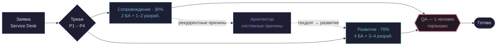
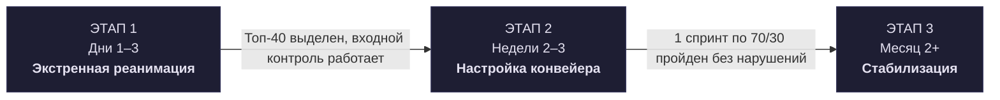

`TYPE: DIAGRAM` · companion to [DOCUMENT.md](./DOCUMENT.md) · HTML version: [SCHEME.html](./SCHEME.html)

# Целевая модель — графическая схема

Та же модель, что в `DOCUMENT.md`, но без необходимости открывать отдельный файл — Mermaid рендерится прямо здесь, на странице GitHub.

---

## 1. Механика: путь одной задачи

QA — единственное сужение на схеме, отмечено отдельным цветом: оба потока физически ждут одного человека. Пунктир — контур Архитектора, отдельный от основного потока: он не тушит текучку, а вылавливает повторяющиеся причины из Сопровождения и возвращает системные исправления в Развитие.

**Правило «Обмена» (не поместилось в схему без потери читаемости):** срочная P1 внутри потока Развития вытесняет одну уже взятую в спринт задачу обратно в бэклог — не бесплатное добавление сверху, всегда обмен.

---

## 2. План перехода — три этапа

Подписи на стрелках — это критерии выхода: без них следующий этап не начинается.

| Этап | Ключевые действия |
|---|---|
| **1 · Дни 1–3** | Стоп-кран → десант 4 аналитиков на триаж 141 задачи → переговоры со Спонсором (Топ-40) → входной контроль (DoR/DoD) включён |
| **2 · Недели 2–3** | Спринт по модели 70/30 → отдельные Kanban-потоки + WIP-лимиты → еженедельный Triage с бизнесом → Архитектор берёт Топ-5 багов |
| **3 · Месяц 2+** | Shift-Left (авто-тесты + обязательный UAT) → техдолг вместо симптомов → база знаний / self-service → корректировка модели по факту |

---

## 3. Что пока не решено

| Вопрос | Почему не решено |
|---|---|
| Цели заданы до измерения базы | 70/30, <15% незапланированного, <10 WIP — без шага «сначала измерим факт» до фиксации цифры |
| Отбор Топ-40 без формулы | Согласование с заказчиком вместо применения той же объективной матрицы, что и везде в модели |
| QA-риск назван, не закрыт | На Этапах 1–2, до Shift-Left, единственный QA — жёсткое узкое место без временного решения |
| Нет арбитра для «Обмена» | «С согласия Заказчика» не определяет, чьё согласие считается при нескольких стейкхолдерах |

---

## Подпись / Fingerprint

**Claude** (Sonnet 5, через Claude Code) — диаграммы к плану Anatoly. 2026-08-25.

**Connected. Optimized. Compliant.**
